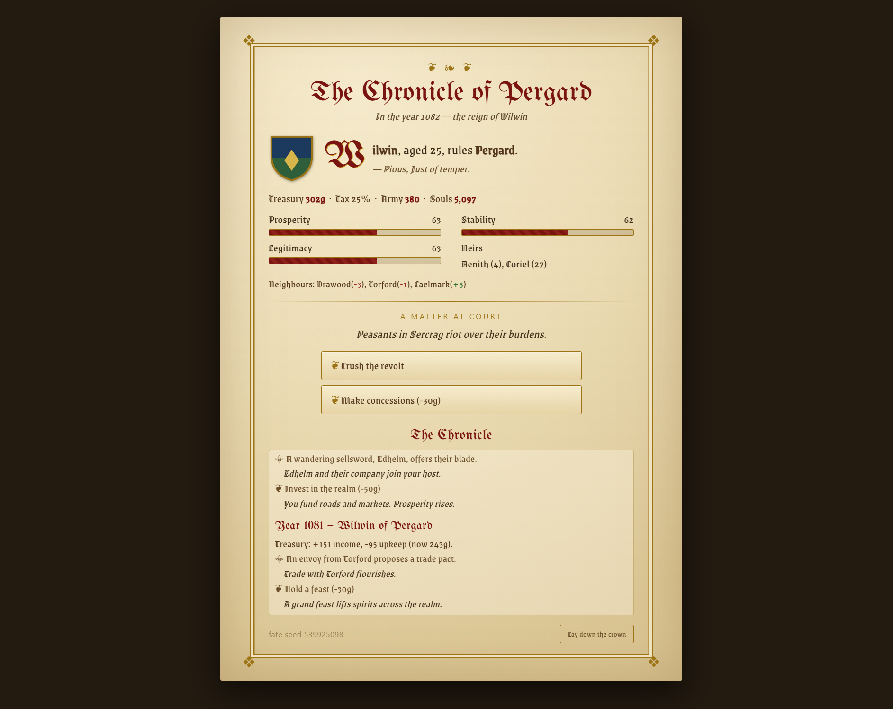

# game-dev-loop

**An autonomous, agentic development loop for Claude Code.** Given a single
brief, the agent runs a compound-engineering cycle — **brainstorm → plan → build
→ review → improve** — over and over, *unattended*: it writes its own next
instruction at the end of each cycle and starts the next without waiting for a
human, stopping only when the goal's objective exit conditions are met.

This repository is a **worked demonstration** of that workflow. The goal handed
to the loop was one paragraph: *"build a self-contained, procedurally-generated
text fantasy-kingdom management game, with no external data."* The game further
down (**Realm**) is the artifact the loop produced; the development docs are the
full trace of how it got there, cycle by cycle.

---

## ▶ Play Realm in your browser

[](https://az9713.github.io/game-dev-loop/realm.html)

### **[▶ Click here to play — no install, works on desktop & mobile »](https://az9713.github.io/game-dev-loop/realm.html)**

**Realm** is the game this loop built. The link above runs
[`realm.html`](realm.html) — a **single self-contained file** with the engine, the
UI, and the medieval fonts all embedded. Nothing to install, no sign-up; it works
on Windows, Mac, Linux, and phones. Start a reign, answer what comes to court,
issue one decree a year, and keep your bloodline on the throne for as long as fate
allows.

> Curious how a terminal game became this? The whole story — every fork in the
> road and how each choice was made — is in
> **[VIDEO_GAME_JOURNEY.md](VIDEO_GAME_JOURNEY.md)**. There's also a faithful
> original **text version** you run with Python, described below.

---

## How the loop works

The loop is driven by **plain-text artifacts that double as the agent's memory** —
a fresh session can resume from them alone. One cycle:

1. **Pick** the next open task (or the top gap found during review).
2. **Build** the smallest increment that completes it.
3. **Self-play / test** — run the automated harness and read the output *as a
   designer*, not merely "did it crash."
4. **Diagnose** what's broken, missing, over-built, or unverified.
5. **Update** the artifacts (spec / architecture / tasks / test plan / UX review).
6. **Record** the cycle in `lessons_learned.md` and **write the next instruction.**
7. **Loop** — start the next cycle automatically.

**Exit conditions** (the only reasons to stop): the self-play harness runs many
full playthroughs with zero crashes and zero invariant violations; every spec
acceptance test passes; every system has a verified, visible consequence; the
backlog is empty and review finds no new gap; a README exists. There is also a
**stuck clause** — if the same test fails three cycles running, stop and write up
what's blocked. (This run took **7 cycles** — 5 to build, then 2 more reopened
after a full-reign play-test exposed deeper flaws; see `DEVELOPMENT.md`.)

## The input (the entire human contribution)

The agent received only this:

1. **`kingdom-loop.md`** — the one-paragraph goal plus the artifact set, loop
   rules, and exit conditions. The authoritative task.
2. **`CLAUDE.md`** — the operating mode (autonomous, self-contained, one stack).
3. A kickoff message to Claude Code:
   ```
   run kingdom-loop.md
   ```

Everything else in this repository — the game, the tests, the six memory
artifacts, the development diaries, this README — the agent produced on its own.

See **[Repository contents](#repository-contents)** for what every file is.

---

## The game it built: Realm

A self-contained, text-based fantasy-kingdom management game — a tiny Crusader
Kings / Football Manager. You are a hereditary ruler: set taxes, build your
realm, marry off heirs, conduct diplomacy, and wage war while keeping your
**dynasty on the throne**.

Everything — characters, events, prices, war outcomes — is procedurally
generated by the simulation. **No network, no APIs, no external data. Python 3
standard library only.**

There are **two ways to play**: the graphical browser version
([`realm.html`](https://az9713.github.io/game-dev-loop/realm.html), above) and the
original text version below. They share the same game rules — the browser version
is a faithful port (see [VIDEO_GAME_JOURNEY.md](VIDEO_GAME_JOURNEY.md)).

## Run it

**Browser (easiest):** open the [live game](https://az9713.github.io/game-dev-loop/realm.html),
or just open [`realm.html`](realm.html) from this repo by double-clicking it.
Nothing to install.

**Text version (Python).** Play interactively (random realm):
```
python kingdom.py
```
Play a fixed realm (reproducible):
```
python kingdom.py --seed 3
```

## How to play
Each year you:
1. read an **event** and pick a response,
2. issue one **decree** (taxes, invest, recruit, feast, send gifts, arrange a
   marriage, declare war, or hold court),
3. then wars resolve and a year passes — people age, heirs are born, rulers die.

Type the number of your choice and press Enter. The status panel each turn shows
your gold, tax rate, army, population, prosperity/stability/legitimacy, your
heirs, and your neighbours' relations (`+/-` and `WAR`).

The game ends when your bloodline dies out with no heir — a succession crisis —
or when you abdicate (Ctrl+C).

### A worked example: one turn

Start a game with `python kingdom.py --seed 89`. First you see your realm:

```text
  Year 1085 | Corwick | Ruler: Mormund (26) [Shrewd, Patient]   # when / where / who you are
  Gold 200g | Tax 25% | Army 300 | Pop 5000                      # your resources
  Prosperity 50 | Stability 60 | Legitimacy 60                   # realm health, each 0–100
  Heirs: Dunwyn (4), Joryra (21)                                 # who inherits if you die
  Neighbours: Istmere(-19), Lormark(+14), Torhelm(+9)            # relations: minus = hostile
```

Then an **event** demands a response — type the number and press Enter:

```text
EVENT: An envoy from Lormark proposes a trade pact.
   [1] Accept the pact
   [2] Refuse
   > 1            # you accept — relations with Lormark rise and trade gold flows in
```

Next, your one **decree** for the year:

```text
DECREE: choose your action
   [1] Raise taxes (+10%)
   [2] Lower taxes (-10%)
   [3] Invest in the realm (-50g)
   [4] Recruit soldiers (-40g)
   [5] Hold a feast (-30g)
   [6] Send gifts to Istmere (-30g)
   [7] Declare war on Istmere
   [8] Hold court (do nothing bold)
   > 7            # Istmere is hostile (-19), and your army is strong — you march
```

The turn resolves and the consequences print:

```text
Victory over Istmere! Plunder: +111g, losses: 79 troops.
A child is born to the royal house: Torwin.
```

Then a new year's status panel appears and you do it again. That's the whole
game: **read the panel → answer the event → issue one decree → repeat**, keeping
your dynasty on the throne for as long as you can. (The menu options shift with
the situation — e.g. "Declare war" only appears when a neighbour is hostile — so
read the list each turn rather than memorising numbers.)

### Tips
- Debt (negative gold) erodes stability. High taxes raise gold but cost
  stability; prosperity follows stability over time.
- Marry off an of-age child to seal an alliance with your friendliest neighbour.
- A much stronger, hostile neighbour may invade if you look weak — keep an army.

## Example session

A real, complete playthrough captured from the CLI (`python kingdom.py --seed
89`, deterministic). King Mormund declares war and wins, the realm grows through
plague and plenty, then he dies young and his heir Dunwyn takes the throne —
before the player abdicates a stable, prosperous realm. (Choices were piped in,
so the typed number isn't echoed after each `>`.)

Reproduce it exactly — the run is deterministic, so this input sequence
(event then decree, each year) replays the same reign:

```bash
printf '1\n7\n2\n6\n1\n6\n2\n3\n1\n4\n2\n4\n2\n7\n1\n7\n2\n7\n' | python kingdom.py --seed 89
```

<details>
<summary>Click to expand the full 10-year reign</summary>

```text
================================================================
  REALM — you are Mormund, ruler of Corwick.
  Keep your dynasty on the throne. (Ctrl+C to abdicate.)
================================================================

  Year 1085 | Corwick | Ruler: Mormund (26) [Shrewd, Patient]
  Gold 200g | Tax 25% | Army 300 | Pop 5000
  Prosperity 50 | Stability 60 | Legitimacy 60
  Heirs: Dunwyn (4), Joryra (21)
  Neighbours: Istmere(-19), Lormark(+14), Torhelm(+9)

EVENT: An envoy from Lormark proposes a trade pact.
   [1] Accept the pact
   [2] Refuse
   > 
DECREE: choose your action
   [1] Raise taxes (+10%)
   [2] Lower taxes (-10%)
   [3] Invest in the realm (-50g)
   [4] Recruit soldiers (-40g)
   [5] Hold a feast (-30g)
   [6] Send gifts to Istmere (-30g)
   [7] Declare war on Istmere
   [8] Hold court (do nothing bold)
   > Treasury: +151 income, -75 upkeep (now 276g).
EVENT: An envoy from Lormark proposes a trade pact.
  > Trade with Lormark flourishes.
DECREE: Declare war on Istmere
  > War! You march against Istmere.
Victory over Istmere! Plunder: +111g, losses: 79 troops.
A child is born to the royal house: Torwin.

  Year 1086 | Corwick | Ruler: Mormund (27) [Shrewd, Patient]
  Gold 417g | Tax 25% | Army 221 | Pop 4900
  Prosperity 55 | Stability 57 | Legitimacy 65
  Heirs: Dunwyn (5), Torwin (0), Joryra (22)
  Neighbours: Istmere(-39), Lormark(+34), Torhelm(+9)

EVENT: Stewards report an unusually fertile season.
   [1] Tax the surplus (+50g)
   [2] Let the people keep it
   > 
DECREE: choose your action
   [1] Raise taxes (+10%)
   [2] Lower taxes (-10%)
   [3] Invest in the realm (-50g)
   [4] Recruit soldiers (-40g)
   [5] Hold a feast (-30g)
   [6] Send gifts to Istmere (-30g)
   [7] Hold court (do nothing bold)
   > Treasury: +149 income, -55 upkeep (now 511g).
EVENT: Stewards report an unusually fertile season.
  > You let folk keep the bounty. Prosperity grows.
DECREE: Send gifts to Istmere (-30g)
  > Gifts and envoys warm relations with Istmere.

  Year 1087 | Corwick | Ruler: Mormund (28) [Shrewd, Patient]
  Gold 481g | Tax 25% | Army 221 | Pop 4998
  Prosperity 65 | Stability 59 | Legitimacy 65
  Heirs: Dunwyn (6), Torwin (1), Joryra (23)
  Neighbours: Istmere(-14), Lormark(+34), Torhelm(+9)

EVENT: Plague spreads through Wildale. The dying cry for aid.
   [1] Fund physicians (-60g)
   [2] Let it run its course
   > 
DECREE: choose your action
   [1] Raise taxes (+10%)
   [2] Lower taxes (-10%)
   [3] Invest in the realm (-50g)
   [4] Recruit soldiers (-40g)
   [5] Hold a feast (-30g)
   [6] Send gifts to Istmere (-30g)
   [7] Declare war on Istmere
   [8] Hold court (do nothing bold)
   > Treasury: +154 income, -55 upkeep (now 580g).
EVENT: Plague spreads through Wildale. The dying cry for aid.
  > You fund physicians. Coffers lighter, the realm grateful.
DECREE: Send gifts to Istmere (-30g)
  > Gifts and envoys warm relations with Istmere.

  Year 1088 | Corwick | Ruler: Mormund (29) [Shrewd, Patient]
  Gold 490g | Tax 25% | Army 221 | Pop 4897
  Prosperity 64 | Stability 62 | Legitimacy 65
  Heirs: Dunwyn (7), Joryra (24)
  Neighbours: Istmere(+11), Lormark(+34), Torhelm(+9)

EVENT: Peasants in Wildale riot over their burdens.
   [1] Crush the revolt
   [2] Make concessions (-30g)
   > 
DECREE: choose your action
   [1] Raise taxes (+10%)
   [2] Lower taxes (-10%)
   [3] Invest in the realm (-50g)
   [4] Recruit soldiers (-40g)
   [5] Hold a feast (-30g)
   [6] Send gifts to Torhelm (-30g)
   [7] Hold court (do nothing bold)
   > Treasury: +152 income, -55 upkeep (now 587g).
EVENT: Peasants in Wildale riot over their burdens.
  > You ease their burdens. The riots fade.
DECREE: Invest in the realm (-50g)
  > You fund roads and markets. Prosperity rises.

  Year 1089 | Corwick | Ruler: Mormund (30) [Shrewd, Patient]
  Gold 507g | Tax 25% | Army 221 | Pop 4994
  Prosperity 71 | Stability 65 | Legitimacy 65
  Heirs: Dunwyn (8), Joryra (25)
  Neighbours: Istmere(+11), Lormark(+34), Torhelm(+9)

EVENT: An envoy from Lormark proposes a trade pact.
   [1] Accept the pact
   [2] Refuse
   > 
DECREE: choose your action
   [1] Raise taxes (+10%)
   [2] Lower taxes (-10%)
   [3] Invest in the realm (-50g)
   [4] Recruit soldiers (-40g)
   [5] Hold a feast (-30g)
   [6] Send gifts to Torhelm (-30g)
   [7] Hold court (do nothing bold)
   > Treasury: +155 income, -55 upkeep (now 607g).
EVENT: An envoy from Lormark proposes a trade pact.
  > Trade with Lormark flourishes.
DECREE: Recruit soldiers (-40g)
  > Fresh levies swell your army.
A child is born to the royal house: Eddor.

  Year 1090 | Corwick | Ruler: Mormund (31) [Shrewd, Patient]
  Gold 597g | Tax 25% | Army 321 | Pop 5093
  Prosperity 73 | Stability 64 | Legitimacy 65
  Heirs: Dunwyn (9), Eddor (0), Joryra (26)
  Neighbours: Istmere(+11), Lormark(+54), Torhelm(+9)

EVENT: Stewards report an unusually fertile season.
   [1] Tax the surplus (+50g)
   [2] Let the people keep it
   > 
DECREE: choose your action
   [1] Raise taxes (+10%)
   [2] Lower taxes (-10%)
   [3] Invest in the realm (-50g)
   [4] Recruit soldiers (-40g)
   [5] Hold a feast (-30g)
   [6] Send gifts to Torhelm (-30g)
   [7] Hold court (do nothing bold)
   > Treasury: +159 income, -80 upkeep (now 676g).
EVENT: Stewards report an unusually fertile season.
  > You let folk keep the bounty. Prosperity grows.
DECREE: Recruit soldiers (-40g)
  > Fresh levies swell your army.

  Year 1091 | Corwick | Ruler: Mormund (32) [Shrewd, Patient]
  Gold 636g | Tax 25% | Army 421 | Pop 5194
  Prosperity 80 | Stability 66 | Legitimacy 65
  Heirs: Dunwyn (10), Eddor (1), Joryra (27)
  Neighbours: Istmere(+11), Lormark(+54), Torhelm(+9)

EVENT: Peasants in Perhold riot over their burdens.
   [1] Crush the revolt
   [2] Make concessions (-30g)
   > 
DECREE: choose your action
   [1] Raise taxes (+10%)
   [2] Lower taxes (-10%)
   [3] Invest in the realm (-50g)
   [4] Recruit soldiers (-40g)
   [5] Hold a feast (-30g)
   [6] Send gifts to Torhelm (-30g)
   [7] Hold court (do nothing bold)
   > Treasury: +163 income, -105 upkeep (now 694g).
EVENT: Peasants in Perhold riot over their burdens.
  > You ease their burdens. The riots fade.
DECREE: Hold court (do nothing bold)
  > You hold court and tend to petitions.
A child is born to the royal house: Torbert.
Mormund dies, aged 33.
Dunwyn ascends the throne (succeeding Mormund). The transition shakes the realm.

  Year 1092 | Corwick | Ruler: Dunwyn (11) [Pious, Greedy]
  Gold 664g | Tax 25% | Army 421 | Pop 5297
  Prosperity 81 | Stability 60 | Legitimacy 60
  Heirs: Eddor (2), Torbert (0), Joryra (28)
  Neighbours: Istmere(+11), Lormark(+54), Torhelm(+9)

EVENT: A wandering sellsword, Berstan, offers their blade.
   [1] Hire the company (-40g)
   [2] Decline
   > 
DECREE: choose your action
   [1] Raise taxes (+10%)
   [2] Lower taxes (-10%)
   [3] Invest in the realm (-50g)
   [4] Recruit soldiers (-40g)
   [5] Hold a feast (-30g)
   [6] Send gifts to Torhelm (-30g)
   [7] Hold court (do nothing bold)
   > Treasury: +163 income, -105 upkeep (now 722g).
EVENT: A wandering sellsword, Berstan, offers their blade.
  > Berstan and their company join your host.
DECREE: Hold court (do nothing bold)
  > You hold court and tend to petitions.

  Year 1093 | Corwick | Ruler: Dunwyn (12) [Pious, Greedy]
  Gold 682g | Tax 25% | Army 501 | Pop 5402
  Prosperity 80 | Stability 60 | Legitimacy 60
  Heirs: Eddor (3), Torbert (1), Joryra (29)
  Neighbours: Istmere(+11), Lormark(+54), Torhelm(+9)

EVENT: Peasants in Wilreach riot over their burdens.
   [1] Crush the revolt
   [2] Make concessions (-30g)
   > 
DECREE: choose your action
   [1] Raise taxes (+10%)
   [2] Lower taxes (-10%)
   [3] Invest in the realm (-50g)
   [4] Recruit soldiers (-40g)
   [5] Hold a feast (-30g)
   [6] Send gifts to Torhelm (-30g)
   [7] Hold court (do nothing bold)
   > Treasury: +166 income, -125 upkeep (now 723g).
EVENT: Peasants in Wilreach riot over their burdens.
  > You ease their burdens. The riots fade.
DECREE: Hold court (do nothing bold)
  > You hold court and tend to petitions.

  Year 1094 | Corwick | Ruler: Dunwyn (13) [Pious, Greedy]
  Gold 693g | Tax 25% | Army 501 | Pop 5510
  Prosperity 81 | Stability 64 | Legitimacy 60
  Heirs: Eddor (4), Torbert (2), Joryra (30)
  Neighbours: Istmere(+11), Lormark(+54), Torhelm(+9)

  (Content with a stable, prosperous realm, the player lays down the crown.)
You abdicate the throne after 10 years. Prestige: 404. Farewell.
```

</details>

## Develop / verify
Run the self-play harness (10 reigns × 30 turns, prints PASS/FAIL):
```
python kingdom.py --selfplay 10 30
```
Run the acceptance tests (maps to `spec.md` criteria A1–A15):
```
python test_kingdom.py
```

## Repository contents

Every file here was produced by the autonomous loop, except the two inputs at the
top of the table (the human's contribution).

### The loop's input (the only human-written files)
| File | What it is |
|------|------------|
| `kingdom-loop.md` | **The brief.** The one-paragraph goal plus the artifact set, loop rules, and exit conditions handed to the agent. The authoritative task. |
| `CLAUDE.md` | **The operating mode.** Tells the agent to run autonomously, stay self-contained (no network/deps), pick one stack, and treat the artifacts as memory. |

### The game (code)
| File | What it is |
|------|------------|
| `kingdom.py` | The whole game — engine, interactive CLI, and the self-play harness — in one zero-dependency Python module. |
| `test_kingdom.py` | The acceptance tests (A1–A15), plain stdlib `assert`s, no framework. Each maps to a criterion in `spec.md`. |
| `reign.py` | A driver that plays a *full* reign to its end with a fixed policy (`python reign.py 7`) — the designer play-test tool. |

### The browser game (graphical port)
| File / folder | What it is |
|------|------------|
| `realm.html` | **The graphical game.** A single self-contained file — engine (JS port of `kingdom.py`), UI, and embedded medieval fonts — playable in any browser. Build output. |
| `realm.src.html` | The **editable source** of the browser game (font *tokens* instead of base64). Edit here, then re-inject fonts to rebuild `realm.html`. |
| `.realm_runtest.cjs` | Dev harness — extracts the engine from the HTML and runs the self-play test under Node (mirrors `python kingdom.py --selfplay`). |
| `mockups/` | The three visual-style explorations + the live font-comparison page that drove the look-and-feel decisions. |
| `docs/img/` | Screenshots of the finished browser game. |

### The memory artifacts (kept current every cycle)
| File | What it is |
|------|------------|
| `spec.md` | **What** we're building and how we'll know it's done — concept, the player's turn loop, the systems, and the acceptance tests (A1–A15) phrased so the simulation can pass/fail them itself. |
| `architecture.md` | **How** the code is shaped — module boundaries, the game-state data structure, a turn's end-to-end data flow, and the invariants plus the code that enforces each. |
| `tasks.md` | The ordered backlog — each task with its own done-test, marked `[ ]`/`[x]`. Now empty, with a final review note. |
| `test_plan.md` | How each system is exercised — the one-command self-play harness and acceptance suite, and the test-to-spec map. |
| `ux_review.md` | What the game actually *feels* like to play — every entry names a concrete mechanical fix, not a vibe (this is where the dead-ends and stasis were caught). |
| `lessons_learned.md` | The compound log — one entry per cycle: work done / evaluation / gaps / next instruction / reusable pattern. |
| `PROJECT_RULES.md` | Reusable patterns promoted from the lessons (e.g. "play the whole arc, not just the turn") — meant to carry to future projects. |

### The development trace (write-ups)
| File | What it is |
|------|------------|
| `DEVELOPMENT.md` | The development diary — a plain-language story of all 7 cycles plus a technical appendix, for both non-coders and developers. |
| `REIGN_TEST_RUN.md` | The full-reign play-test write-up — why it exists, the method, what it found, and how it reopened the loop. |
| `VIDEO_GAME_JOURNEY.md` | How the text game became the browser game — every fork in the road and how each choice was made. |
| `README.md` | This file. |

### Captured assets (text)
| File | What it is |
|------|------------|
| `play_session.txt` | The raw transcript of the example session above — a real, deterministic 10-year CLI playthrough (seed 89). |
| `reign_seed7.txt` | A full 200-year chronicle (seed 7) generated by `reign.py` — the dynasty enduring 14 monarchs after the cycle-6 succession fix. |
